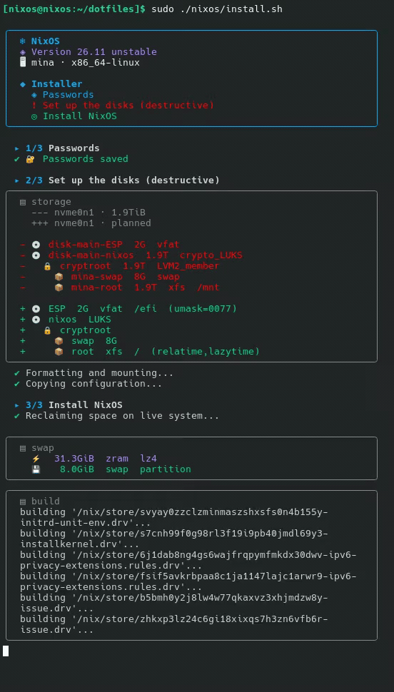
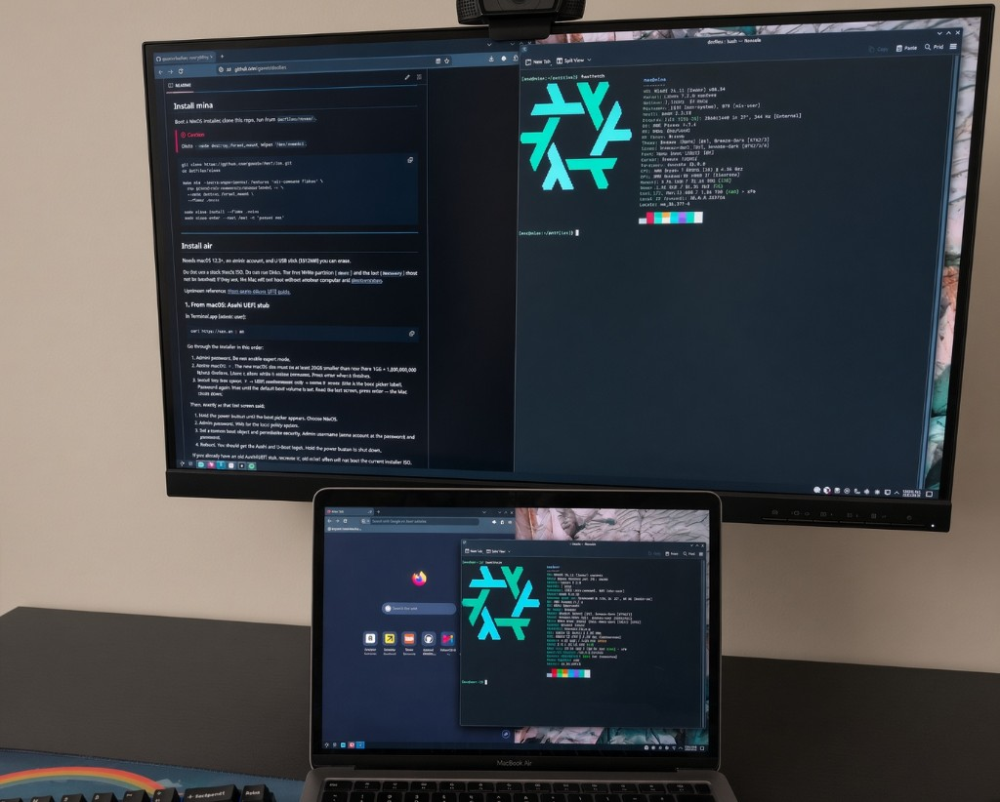

<div align="center">

**NixOS** · Flakes · Plasma 6 · mina (AMD) · air (M1)

[](https://nixos.org)
[](https://nixos.wiki/wiki/Flakes)
[](https://kde.org/plasma-desktop/)
[](https://github.com/gaavin/dotfiles)

</div>

> [!WARNING]
> **This project was primarily written by an LLM (AI). Review the code yourself before running it. Use at your own risk.**

## Install

Boot a NixOS installer, clone this repo, run the script.

<p align="center">
  
</p>

> [!CAUTION]
> **Destructive** This script will wipe any (except for mac related partitions) existing partitions on the preconfigured disks (/dev/nvme0n1).

> **😪😪😪** This configuration takes a long time to build for the first time. The script will prevent your computer from going to sleep.


```bash
# if you need to connect to wifi
nmtui

git clone https://github.com/gaavin/dotfiles.git
cd dotfiles
sudo ./nixos/install.sh
```

### Air, from macOS

```bash
curl https://alx.sh | sh
```

1. Admin password. **Do not** enable expert mode.
2. Resize macOS: `r`. New size must be at least 20GB smaller (here 1GB = 1,000,000,000 bytes). Confirm. Wait (minutes), then press enter.
3. Install into free space: `f` → **UEFI environment only** → name it `NixOS`. Password again. Wait until the default boot volume is set. Read the last screen, press enter — the Mac shuts down.
4. Hold power until the boot picker appears. Choose **NixOS**.
5. Admin password. Wait for the local policy update.
6. Set a custom boot object and **permissive security**. Same admin username and password.
7. Reboot. You should get the Asahi and U-Boot logos. Hold power to shut down.

Write the latest `*-apple-silicon-*.iso` from [nixos-apple-silicon releases](https://github.com/nix-community/nixos-apple-silicon/releases) to the **usb disk**, unfortunately other solutions such as Ventoy are not working.

macOS (`diskutil list` → USB, e.g. `disk4`):

```bash
diskutil unmountDisk /dev/disk4
sudo dd if=nixos-*.iso of=/dev/rdisk4 bs=1m
```

Linux:

```bash
sudo dd if=nixos-*.iso of=/dev/sdX bs=4M status=progress oflag=direct
```

Plug in the USB and power on. Then run **Install** above.

---

## Rebuild

Updates the flake and runs `nixos-rebuild switch` for the current hostname. On air, also syncs firmware from `/efi` on asahi machines.

```bash
rebuild
```

<p align="center">
  
</p>
